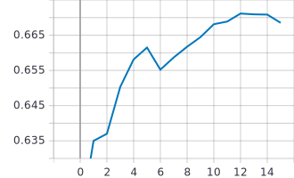
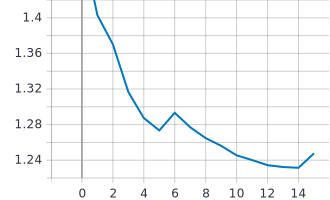

# Лабораторная работа №5.
**Цель лабораторной работы:**
Обучить нейронную сеть с использованием техники
обучения Fine Tuning.

**Задачи:**
1. С использованием примера, техники обучения Transfer Learning,
оптимальной политики изменения темпа обучения, аугментации данных с
оптимальными настройками обучить нейронную сеть EfficientNet-B0
(предварительно обученную на базе изображений imagenet) для решения задачи
классификации изображений Food-101 

2. С использованием техники обучения Fine Tuning дополнительно обучить
нейронную сеть EfficientNet-B0 предварительно обученную в пункте 2 
**Замечания**: В данной лабораторной работе параметр BATCH_SIZE равен 32. Оптимальная политика изменения темпа обучения - cosine decay with restarts с параметрами: initial_learning_rate = 0.001, first_decay_steps = 5000, t_mul = 2.0, m_mul = 0.75. Аугментация данных со следующими параметрами: RandomFlip - 'horizontal', RandomCrop - апскейл до 300x260, RandomRotation - factor=0.04, fill_mode='nearest'.

## 1. С использованием примера, техники обучения Transfer Learning, оптимальной политики изменения темпа обучения, аугментации данных с оптимальными настройками обучить нейронную сеть EfficientNet-B0 (предварительно обученную на базе изображений imagenet) для решения задачи классификации изображений Food-101 
* **Графики обучения с использованием Transfer Learning**:  
   * График точности epoch_categorical_accuracy:
   
   
 
   * График функции потерь epoch_loss:
   
   
   
 * **Анализ полученных результатов**: Наивысшие значения метрики точности наблюдаются на графике с горизонтальным отображением (67.99%). Также на графике функции потерь горизонтального отображения наблюдаются наименьшие значения (1.194). По сравнению с базовой нейронной сетью, мы выйграли ~0.1% точности. По времени достигания пика значений изменений нет. Оптимальным параметром будет 'horizontal'.
