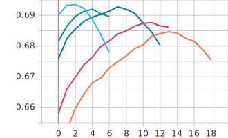
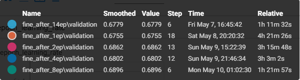
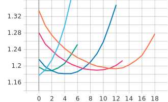
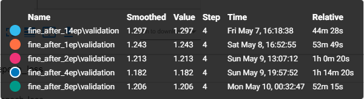

# Лабораторная работа №5.
**Цель лабораторной работы:**
Обучить нейронную сеть с использованием техники
обучения Fine Tuning.

**Задачи:**
1. С использованием примера, техники обучения Transfer Learning,
оптимальной политики изменения темпа обучения, аугментации данных с
оптимальными настройками обучить нейронную сеть EfficientNet-B0
(предварительно обученную на базе изображений imagenet) для решения задачи
классификации изображений Food-101 

2. С использованием техники обучения Fine Tuning дополнительно обучить
нейронную сеть EfficientNet-B0 предварительно обученную в пункте 2 
**Замечания**: В данной лабораторной работе параметр BATCH_SIZE равен 32. Оптимальная политика изменения темпа обучения - cosine decay with restarts с параметрами: initial_learning_rate = 0.001, first_decay_steps = 5000, t_mul = 2.0, m_mul = 0.75. Аугментация данных со следующими параметрами: RandomFlip - 'horizontal', RandomCrop - апскейл до 300x260, RandomRotation - factor=0.04, fill_mode='nearest'.

## 1. С использованием примера, техники обучения Transfer Learning, оптимальной политики изменения темпа обучения, аугментации данных с оптимальными настройками обучить нейронную сеть EfficientNet-B0 (предварительно обученную на базе изображений imagenet) для решения задачи классификации изображений Food-101 
* **Графики обучения с использованием Transfer Learning**:  
   * График точности epoch_categorical_accuracy:
   
 
   * График функции потерь epoch_loss:
   
   
 * **Анализ полученных результатов**: В данном случае, у нас достигается максимальная точность на 12 эпохе(67.12%), а минимальное значение функции потерь на 14 эпохе(1.231).
## 2. С использованием техники обучения Fine Tuning дополнительно обучить нейронную сеть EfficientNet-B0 предварительно обученную в пункте 2
  Стоит отметить, что в этом пункте мы выделили как гиперпараметр количество эпох обучения методом Transfer Lerning, после которого мы начинали использовать метод Fine Tuning.  
  Для случаев 1, 2, 4, 8 эпох Transfer Learning мы сначала сохраняли модель форматом Keras H5, после чего загружали модель и начинали использовать метод Fine Tuning. 
  * **Графики обучения с использованием Fine Tuning**:  
   * График точности epoch_categorical_accuracy:
   
   
 
   * График функции потерь epoch_loss:
   
   
   
 * **Анализ полученных результатов**: Из графиков видно, что максимальная точность достигается на 2 эпохе Fine Tuning после 14 эпох Transfer Learning(69.35%). Однако, стоит отметить, что у нас сразу же возникает резкое возрастание значений функции потерь. Возможно, стоило еще уменьшить learning rate на этапе Fine Tuning(в данном случае равен 1e-6).
## Вывод
Метод Fine Tuning помог нам добиться более хороших результатов, чем просто с Transfer Learning (увеличение точности примерно на 2.1%). Однако наши оптимальные параметры политики аугментации данных и темпа обучения в случае с Fine Tuning вероятно перестали быть таковыми. Поэтому, думаю, можно еще улучшить результаты, пересмотрев политики темпа обучения и аугментации данных.
